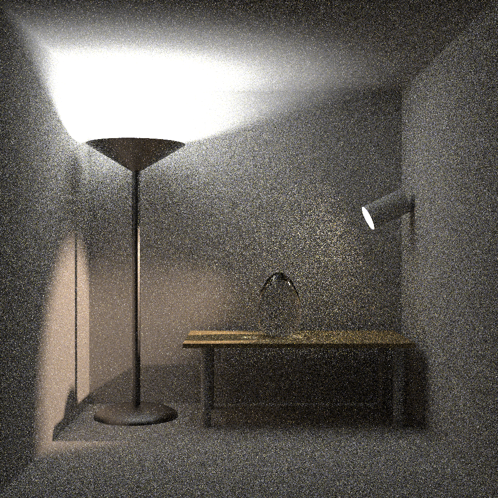
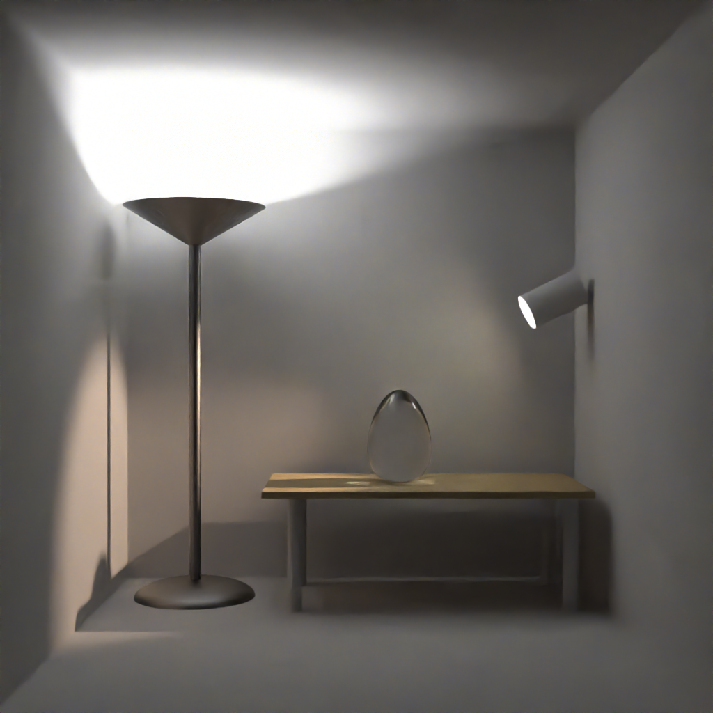

# PyOIDN: Intel Open Image Denoise Python binding


Unofficial Intel [Open Image Denoise (OIDN)](https://www.openimagedenoise.org/) Python binding.

## What you get

- Simple `Device` / `Filter` wrapper around OIDN.
- Numpy arrays as input/output buffers.
- Optional auxiliary inputs (albedo/normal) for ray-traced denoising.

Current implementation only supports NumPy input/output buffers. (A PyTorch version may be added in the future.)

## Install

```bash
pip install pyoidn
```

## Quickstart

Given a noisy image, plus its normal map and albedo map, denoise and save the result.



```python
import numpy as np
from PIL import Image
import pyoidn


def load_image(path: str) -> np.ndarray:
    return np.array(Image.open(path), dtype=np.float32) / 255.0


color = load_image(color_path)
normal = load_image(normal_path)
albedo = load_image(albedo_path)
result = np.zeros_like(color, dtype=np.float32)

device = pyoidn.Device()
device.commit()

flt = pyoidn.Filter(device, "RT")
flt.set_image(pyoidn.OIDN_IMAGE_COLOR, color, pyoidn.OIDN_FORMAT_FLOAT3)
flt.set_image(pyoidn.OIDN_IMAGE_NORMAL, normal, pyoidn.OIDN_FORMAT_FLOAT3)
flt.set_image(pyoidn.OIDN_IMAGE_ALBEDO, albedo, pyoidn.OIDN_FORMAT_FLOAT3)
flt.set_image(pyoidn.OIDN_IMAGE_OUTPUT, result, pyoidn.OIDN_FORMAT_FLOAT3)

flt.commit()
flt.execute()

# Always check errors if something looks off
assert device.get_error() is None

result_u8 = np.array(np.clip(result * 255, 0, 255), dtype=np.uint8)
Image.fromarray(result_u8).save(output_path)

flt.release()
device.release()
```

The result:



## Notes

- Error handling: use `device.get_error()` after creating/committing/executing.
- Async example: see `tests/test.py`.

## License

This project is licensed under the MIT License. See [LICENSE](LICENSE).

This project includes:

- [Intel Open Image Denoise](https://github.com/RenderKit/oidn) (Apache License 2.0)
